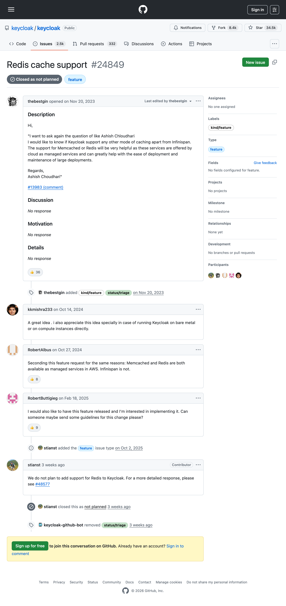

<!--
  WHY.md: the receipts page. Tone rules (do not relax):
  - Respectful and factual. Quote and link; never editorialize the maintainers' decision.
  - The database-vs-cache table does the persuasion, not adjectives.
  - Keep all maintainer quotes verbatim with permalinks. Do not paraphrase a
    maintainer and present it as a quote.
-->

> "The liberty of man, in society, is to be under no other legislative power
> but that established, by consent, in the commonwealth."
>
> John Locke, *Second Treatise of Government*, §95

# Why Locke exists

Keycloak is excellent software. This page is not a complaint about it. It is an
explanation of one design choice we wanted to make differently, and why we built
a distribution to make it possible, by the operator's consent, not instead of
the maintainers' judgment.

## The dilemma

Keycloak lets you choose your database from a long list. It does not let you
choose your cache.

| Layer | Pluggable? | Options |
|---|---|---|
| Database | Yes | PostgreSQL, MariaDB, MySQL, Oracle, MSSQL, H2 (6 supported) |
| Cache | No | Embedded Infinispan only |

The stated reason for keeping the cache fixed is to avoid adding operational
dependencies. That principle is reasonable. The wrinkle is that Keycloak already
supports (and for high availability, effectively requires) an **external**
Infinispan deployment, which is itself a distributed system an operator has to
stand up, tune, and keep alive. So the "no extra dependency to operate" line and
the realities of running Keycloak at scale already sit in tension. That tension
is the dilemma Locke addresses: if an operator is going to run an external
clustered cache anyway, they should be allowed to pick one their cloud already
manages for them.

## The community has been asking

This is not a need we invented.

- **`keycloak/keycloak#24849`**: feature request for a Redis cache option.
  36 👍 reactions. Closed 2026-04-29 with this comment from the project lead:

  > "We do not plan to add support for Redis to Keycloak. For a more detailed
  > response, please see https://github.com/keycloak/keycloak/discussions/48577"
  >
  > [@stianst, 2026-04-29](https://github.com/keycloak/keycloak/issues/24849#issuecomment-4342536303)

  

- **`keycloak/keycloak#13983`**: discussion open since 2022-08-25 asking for the
  same thing.
- Operational pain running embedded/external Infinispan in Kubernetes:
  **`keycloak/keycloak#48947`** (OOM), **`#33658`**, **`#46491`**.

Running highly available Infinispan on Kubernetes has been described by
practitioners as "a full-scale engineering project" in its own right
([Palark](https://blog.palark.com/ha-keycloak-infinispan-kubernetes/)). Every
major cloud, by contrast, offers a managed Redis-compatible service: AWS
ElastiCache/MemoryDB, Azure Cache for Redis, GCP Memorystore.

## What Locke is

- An **Apache 2.0 distribution of Keycloak** that tracks upstream and is rebased
  against it continuously.
- It ships with **both** cache backends. The operator chooses at boot:

  ```bash
  KC_CACHE=infinispan   # the upstream default, unchanged
  KC_CACHE=redis        # Redis / Valkey / any wire-compatible store
  ```

- When `KC_CACHE=infinispan` (the default), Locke behaves exactly like the
  Keycloak it was built from. The Redis path is opt-in.
- In a 3-pod production cluster (`start --optimized`) on isolated nodes, the Redis
  backend delivers **~100% throughput parity** with embedded Infinispan (within
  ~0.1% to 250 logins/sec, zero errors on both). It trades a little read latency
  (in-process Infinispan reads beat a Redis round trip) for a large resilience
  gain: when a node is lost, Infinispan stalls ~31-40s rebalancing while Locke
  keeps serving from Redis with sub-second p99. Cross-version upgrades also roll
  under load (no JGroups version barrier). Full methodology and numbers in
  [benchmark/k8s-ovh/REPORT.md](./benchmark/k8s-ovh/REPORT.md).

## What Locke is not

- **Not a replacement for Keycloak.** It is a packaging of it. The code is
  Keycloak: same `org.keycloak.*` packages, same `KC_*` options, same `kc.sh`.
  This is the Adoptium Temurin / Amazon Corretto / Percona Server pattern: a
  distribution of an upstream project, not a competitor to it.
- **Not a hard fork.** We carry a focused patch set (a handful of upstream files
  plus a self-contained `model/redis/` module) on top of upstream `main`, and a
  CI job rebases and tests against upstream daily.
- **Not an extension.** Four upstream surfaces lock the cache mechanism (a closed
  mechanism enum, hardcoded cache options, an immutable property grouping, and a
  build-step index), so a clean SPI extension is not currently possible. We would
  happily retire the patch set if upstream opened those surfaces.
- **Not a critique of the maintainers.** They made a defensible call for the
  project they steward. We made a different call for the operators we serve.

## "Keycloak" is their trademark

"Keycloak" is a trademark of Red Hat / CNCF. Locke is **Keycloak-compatible**; we
do not imply endorsement by, or affiliation with, the Keycloak project. See
[TRADEMARK.md](./TRADEMARK.md).

---

Keycloak gives you the key. Locke gives you the choice.

This is one of those distributions.
